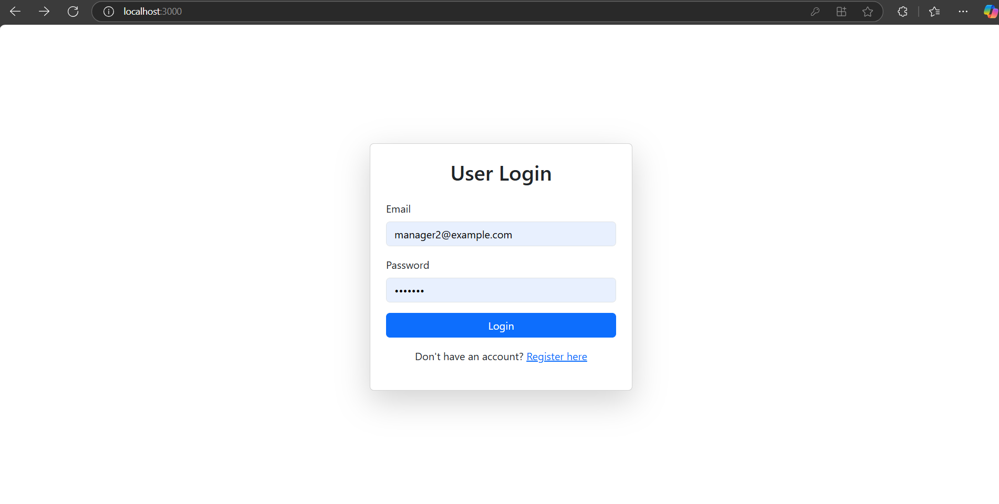
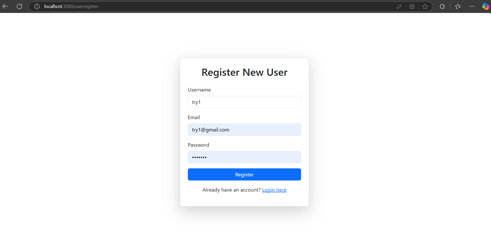
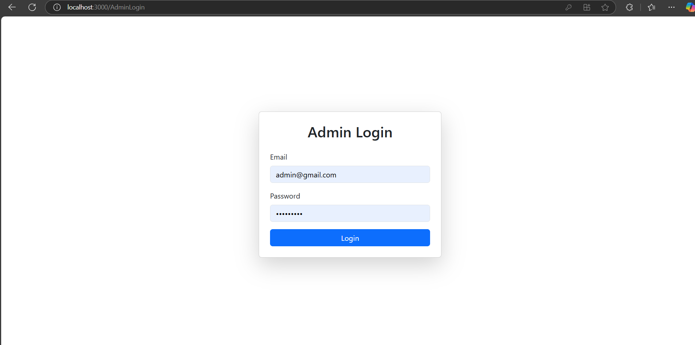
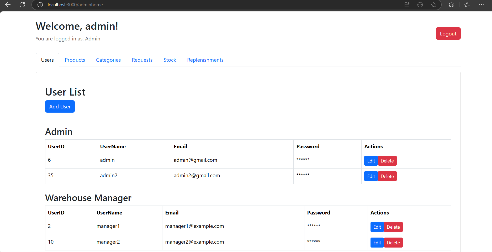

# Inventory Management System

## Table of Contents
- [Overview](#overview)
- [Features](#features)
- [Technologies Used](#technologies-used)
- [Installation](#installation)
- [Usage](#usage)
- [Screenshots](#screenshots)
- [Future Enhancements](#future-enhancements)

## Overview
The Inventory Management System is a web application designed to efficiently manage products, stock movements, replenishments, and user requests. It includes role-based authentication for **Admin, Manager, and Users** with dedicated dashboards for each role.

## Features
- **User Authentication** (Login & Registration for Users, Admin, and Managers)
- **Role-Based Permissions** (Admin, Manager, User)
- **Product Management** (Add, View, Edit, Delete)
- **Stock Management** (Track Stock Movements, Requests, and Replenishments)
- **Admin Dashboard** (Manage Users, View Stocks, Approve Requests)
- **Manager Dashboard** (Manage Replenishments and Stocks)
- **User Dashboard** (Request Products, View Product Listings)

## Technologies Used
- **Frontend:** React, Bootstrap
- **Backend:** Node.js, Express
- **Database:** MySQL
- **Authentication:** JWT

## Installation
1. Clone the repository:
   ```sh
   git clone https://github.com/YERRINATH/WareHouse.git
   cd inventory-management
   ```
2. Install dependencies:
   ```sh
   npm install
   ```
3. Configure MySQL database and update the `.env` file with credentials.
4. Start the backend server:
   ```sh
   npm run server
   ```
5. Start the frontend:
   ```sh
   npm start
   ```

## Usage
- **Admin** can log in and manage users, products, stocks, requests, and replenishments.
- **Managers** handle stock tracking and approval of replenishments.
- **Users** can browse products and make requests.

## Screenshots
### **Authentication**
- **User Login Page**  
  
- **User Register Page**  
  
- **Manager Login Page**  
    
- **Admin Login Page**  
  

### **Admin Dashboard**
- **Users**  
  
- **Categories**  
   
- **Products**  
    
- **Stock Management**  
    
- **Replenishment Requests**  
    
- **Product Requests**  
   

### **Manager Dashboard**
- **Manager Home Page**  
     

### **User Dashboard**
- **User Product Page**  
   
- **User Requests Page**  
    

## Future Enhancements
- Add **email notifications** for stock updates.
- Implement **dashboards** with better UI.
- Enhance **reporting and analytics** for stock movements.


